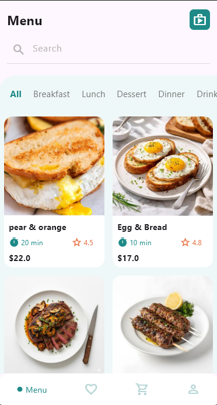
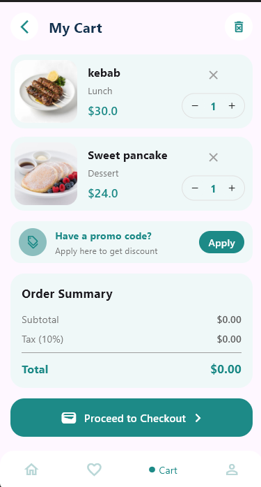
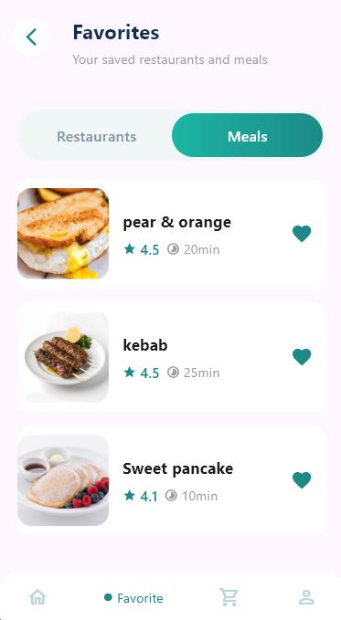
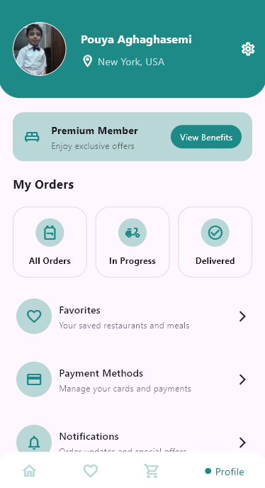

# Fast Food App 🍔

A modern fast food mobile UI built with **Flutter** and **Dart**.

This project includes a food ordering interface with multiple screens and dynamically displays product information fetched from an API.

## 📱 Screens

* Home
* Product Details
* Cart
* Favorites
* Profile

## 🛠️ Technologies

* Flutter
* Dart
* REST API
* Dart Models

## 🌐 API & Data

Product information is fetched from an API and mapped to Dart models.

The product data is then used to display information such as product images and details in the application.

## 📸 Screenshots

### Home

### Product Details

### Cart

### Favorites

### Profile

